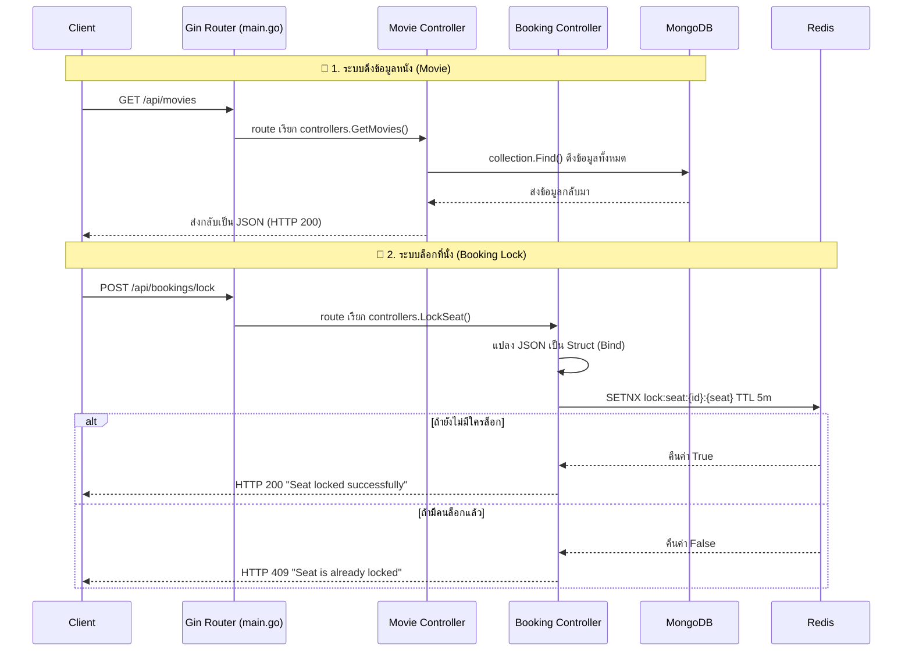

# 🎬 Golden Stage Cinema - Code Walkthrough

เอกสารนี้ถูกสร้างขึ้นเพื่อสรุปและอธิบายการทำงานของโค้ดระบบ Backend (Go + Gin) ที่เราได้สร้างขึ้นมา โดยแบ่งออกเป็น 2 ระบบย่อยที่เราเพิ่งทำเสร็จไปครับ

---

## 🗺️ 1. ภาพรวมการไหลของข้อมูล (Request Flow)

แผนภาพด้านล่างแสดงให้เห็นว่าเมื่อ User (Client) เรียก API เข้ามา ระบบจะทำงานผ่านไฟล์ไหนบ้าง:



---

## 🍿 2. เจาะลึกระบบ Movie (การดึงข้อมูลจาก MongoDB)

ระบบนี้มีหน้าที่ไปดึงรายชื่อหนังจากฐานข้อมูลเพื่อเอามาแสดงผลหน้าเว็บ

**1. การตั้งค่าการเชื่อมต่อ (`config/database.go`)**
```go
func ConnectDB() {
	// อ่านค่าการเชื่อมต่อจาก .env (MONGO_URI)
	mongoURI := os.Getenv("MONGO_URI")
	// กำหนดเวลา Timeout ถ้าต่อ Database นานเกิน 10 วินาทีให้ตัดเลย
	ctx, cancel := context.WithTimeout(context.Background(), 10*time.Second)
	// mongo.Connect ทำหน้าที่วิ่งไปเชื่อมต่อกับ MongoDB จริงๆ
	client, err := mongo.Connect(ctx, clientOptions)
	// นำก้อน Database ยัดใส่ตัวแปร Global ที่ชื่อ DB ไว้ให้ไฟล์อื่นเรียกใช้
	DB = client.Database(dbName)
}
```

**2. โมเดลข้อมูล (`models/movie.go`)**
```go
type Movie struct {
	// primitive.ObjectID คือประเภทข้อมูลพิเศษของ MongoDB ที่ใช้แทน _id
	// bson:"_id" คือการบอกว่าจะ map ตัวแปรนี้เข้ากับฟิลด์ชื่อ _id ใน Database
	// json:"id" คือบอกว่าตอนส่งกลับไปให้ Frontend จะแปลงชื่อฟิลด์เป็น id
	ID primitive.ObjectID `bson:"_id,omitempty" json:"id"`
	Title string `bson:"title" json:"title"`
}
```

**3. ตัวจัดการลอจิก (`controllers/movie_controller.go`)**
```go
func GetMovies(c *gin.Context) {
	// เรียกกล่องข้อมูล (Collection) ที่ชื่อว่า "movies" มาเตรียมไว้
	collection := config.GetCollection("movies")
	
	// สั่งค้นหาข้อมูล (Find) โดยใส่เงื่อนไข bson.M{} (ปีกกาว่างๆ แปลว่าเอามาทั้งหมด ไม่มีเงื่อนไข)
	cursor, err := collection.Find(ctx, bson.M{})
	
	var movies []models.Movie
	// วนลูปอ่านข้อมูลทีละแถวจาก Database แล้วเอามายัดใส่ตัวแปร movies (slice/array)
	cursor.All(ctx, &movies)
	
	// สั่งให้ Gin ตอบกลับ Frontend ด้วย HTTP 200 (OK) พร้อมกับก้อนข้อมูล JSON
	c.JSON(http.StatusOK, movies)
}
```

---

## 💺 3. เจาะลึกระบบ Booking Lock (การล็อกที่นั่งด้วย Redis)

ระบบนี้เป็นหัวใจสำคัญในการป้องกันไม่ให้ผู้ใช้ 2 คน จองที่นั่งเดียวกันในเวลาเดียวกันได้ (Double Booking)

**1. การตั้งค่าการเชื่อมต่อ (`config/redis.go`)**
```go
func ConnectRedis() {
	// คล้ายกับฝั่ง Mongo แต่รอบนี้คือการเชื่อมต่อไปที่ Redis Server
	RedisClient = redis.NewClient(&redis.Options{
		Addr: redisAddr,
	})
}
```

**2. ตัวจัดการลอจิก (`controllers/booking_controller.go`)**
```go
// กำหนดหน้าตาข้อมูลที่ Frontend จะต้องส่งมา
type LockSeatRequest struct {
	ShowtimeID string `json:"showtime_id" binding:"required"` // binding:"required" บังคับว่าห้ามส่งมาเป็นค่าว่าง
	SeatNumber string `json:"seat_number" binding:"required"`
	UserID     string `json:"user_id" binding:"required"`
}

func LockSeat(c *gin.Context) {
	var req LockSeatRequest
	// c.ShouldBindJSON ทำหน้าที่หยิบข้อมูล JSON ที่ Frontend ส่งมา ยัดใส่ตัวแปร req
	if err := c.ShouldBindJSON(&req); err != nil {
		return // ถ้าส่งข้อมูลมาไม่ครบ จะเด้ง Error กลับไปทันที
	}

	// สร้าง Key สำหรับล็อก โดยเอาโชว์ไทม์+เลขที่นั่ง มารวมกัน เช่น "lock:seat:ST123:A1"
	key := fmt.Sprintf("lock:seat:%s:%s", req.ShowtimeID, req.SeatNumber)

	// 🔥 ไฮไลต์สำคัญ: คำสั่ง SETNX (Set if Not eXists) 
	// มันจะยอมสร้าง Key นี้ลง Redis ก็ต่อเมื่อ "ยังไม่มี Key นี้อยู่" เท่านั้น 
	// และตั้งเวลาตาย (TTL) ไว้ 5 นาที (เพื่อที่ถ้าผู้ใช้ล็อกไว้แล้วไม่ยอมจ่ายเงิน ที่นั่งจะหลุดจองอัตโนมัติ)
	success, err := config.RedisClient.SetNX(ctx, key, req.UserID, 5*time.Minute).Result()

	if success {
		// ถ้า SETNX สร้าง Key ได้สำเร็จ (success = true) แปลว่าคุณเป็นคนแรกที่ล็อกได้
		c.JSON(http.StatusOK, gin.H{"message": "Seat locked successfully"})
	} else {
		// ถ้า SETNX คืนค่า False แปลว่ามีคนสร้าง Key นี้ไว้ในระบบแล้ว (โดนแย่งที่นั่ง)
		c.JSON(http.StatusConflict, gin.H{"error": "Seat is already locked by another user"})
	}
}
```

> [!TIP]
> **ทำไมถึงต้องใช้ Redis?** 
> เพราะ Redis ทำงานอยู่บน Memory (RAM) และทำงานแบบ Single-Thread ทำให้มันรันคำสั่ง `SETNX` ได้เร็วมากระดับเสี้ยววินาที และการันตีว่าคำสั่งที่เข้ามาพร้อมๆ กันจะถูกจัดคิวทำทีละคำสั่ง จึงไม่มีโอกาสที่ 2 คำสั่งจะเกิด `success = true` พร้อมกันอย่างเด็ดขาดครับ
